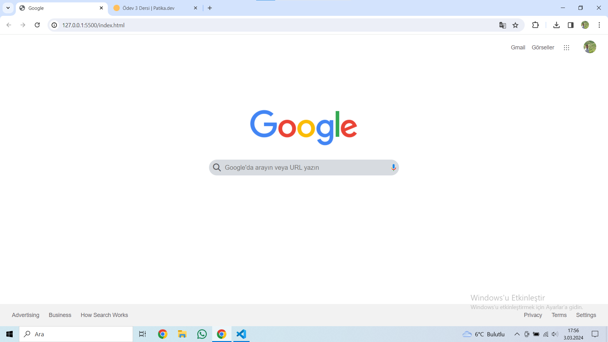

# Google Ana Sayfa Tasarımı

Bu proje, HTML ve CSS kullanarak Google'ın anasayfasının basit bir tasarımını oluşturur. 

## Özellikler

- Basit ve kullanıcı dostu arayüz
- Google'ın resmi renklerini kullanan stil

## Ekran Görüntüleri

## Lisans

Bu proje MIT Lisansı altında lisanslanmıştır. Detaylar için [LICENSE](LICENSE) dosyasına bakınız.

